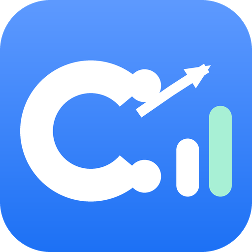

<p align="center">
  
</p>

<h1 align="center">C-Quant</h1>

<p align="center">A desktop research terminal for the three big compliance carbon markets.</p>

<p align="center">
  <a href="https://github.com/hyunjin-kor/C-Quant/actions/workflows/ci.yml"></a>
  <a href="LICENSE"></a>
  <a href=".nvmrc"></a>
</p>

C-Quant pulls official data from the EU ETS, Korea's K-ETS, and China's national ETS, and turns it into one daily read: buy, hold, or reduce. It shows its work. Every number links back to the source it came from, every freshness badge tells you how old that source is, and every model multiplier says whether it was backtested or is still a placeholder.

It is decision support, not a trading tool. It doesn't place orders, hold assets, or give individualized trade instructions.

<p align="center">
  
</p>

## How a session goes

You open the app and land on Command: prices for all three markets, a chart comparing the official close against listed proxies, and a short memo saying what the current posture is and why. From there,

- **Drivers** shows which catalyst scenarios are firing right now, ranked by your driver weights, with the calibration evidence behind each multiplier laid out next to it.
- **Desk** narrows to a single market when you're writing a brief, keeping the other two in the margin for context.
- **Sources** lists where every datum came from, how it was accessed, and when it was last fresh. It's the screen to open in a compliance review.

The typical loop is the same every day: read the official anchor, compare it with the listed tape, check what's firing, decide the posture.

## Where the data comes from

Official anchors first: the EEX auction workbook for the EU, the KRX ETS platform for Korea, and MEE bulletins for China. Listed proxies (ICE EUA futures, KRBN, KEUA and friends) come from public chart feeds and are always labeled as proxies, never mixed in with official settlement prices.

Two free public feeds extend the macro layer: ECB SDW (EUR/USD, no key needed) and FRED (USD/KRW, USD/CNY — needs a free API key). Institutional adapters for Refinitiv, Bloomberg, ICE, and EEX exist but stay in a `not-configured` state until you add credentials. They never invent prices.

## The model, honestly

The posture comes from a driver matrix (about 47 weighted drivers per market, sourced from policy documents and academic literature) plus 21 multi-driver catalyst scenarios. A live detector watches for freshness gaps, price jumps, volume spikes, FX moves, and proxy divergence, and flags a scenario as active when enough of its components fire together.

Scenario multipliers are calibrated against a log of 35 citable historical events (2018–2026) via event study. Each multiplier carries a provenance label so you know how much to trust it:

| Label        | Meaning                                         |
| ------------ | ----------------------------------------------- |
| `heuristic`  | placeholder constant, not yet backed by events  |
| `backtest`   | walk-forward evaluated against 2+ logged events |
| `calibrated` | backtested and signed off by a model owner      |

Right now 11 of the 21 scenarios are at `backtest`, none at `calibrated`. CI fails if the calibration review goes more than 90 days stale, so the numbers can't quietly rot.

None of this is a price forecast. It's a structured way to keep score of the evidence.

## Running it

Node 24+ and Windows 10/11 are the primary targets (macOS and Linux builds exist but are advisory).

```powershell
nvm use
npm install
npm run dev          # Vite + Electron
```

Packaged builds are on the [Releases](https://github.com/hyunjin-kor/C-Quant/releases) page, or build your own:

```powershell
npm run package:portable     # portable .exe
npm run package:nsis         # installer, auto-update wired
```

The binaries aren't code-signed yet, so SmartScreen will warn on first launch. Click "More info", then "Run anyway".

## Development

```bash
npm run type-check
npm run lint
npm run test:all             # vitest + node:test
npm run build
npm run calibration:check    # 90-day calibration freshness gate
npm run encoding:check       # guards Korean copy against mojibake
npm run e2e                  # Playwright smoke
```

Electron 41, React 19, TypeScript, Vite 8, Vitest 4. Three processes (main / preload / renderer) with a single IPC perimeter; everything persists under the Electron `userData` directory. The module map lives in [docs/ARCHITECTURE.md](docs/ARCHITECTURE.md), and [CONTRIBUTING.md](CONTRIBUTING.md) covers the workflow.

## What it deliberately won't do

No order routing, no custody, no settlement — use a licensed broker and registry. No individualized buy/sell calls. No fabricated data: unconfigured feeds say so, unverified sources are labeled `official web flow` rather than "API", and citations are never guessed. The full boundary and per-jurisdiction notes are in [docs/COMPLIANCE.md](docs/COMPLIANCE.md) ([EU](docs/COMPLIANCE-EU.md) · [KR](docs/COMPLIANCE-KR.md) · [CN](docs/COMPLIANCE-CN.md)), and the model's limits are documented in [docs/MODEL_CARD.md](docs/MODEL_CARD.md).

## More docs

[docs/USAGE.md](docs/USAGE.md) walks through each screen. [CHANGELOG.md](CHANGELOG.md) has the release history, [SECURITY.md](SECURITY.md) the threat model.

## License

[MIT](LICENSE). Third-party dependencies keep their own licenses.
