# Usage guide · 사용 가이드

> Read this end-to-end for your first session. Each section ends with a "한 줄 요약" so you can scan quickly.
> 첫 사용 시 처음부터 끝까지 한 번 읽기를 권장합니다. 각 섹션 끝에 한 줄 요약이 있습니다.

<p align="center">
  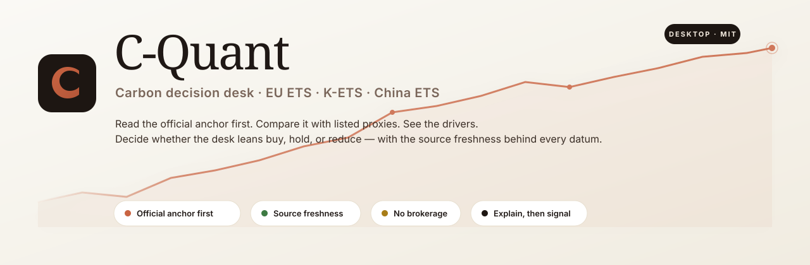
</p>

---

## 1. The four-step decision workflow / 4단계 의사결정 워크플로우

<p align="center">
  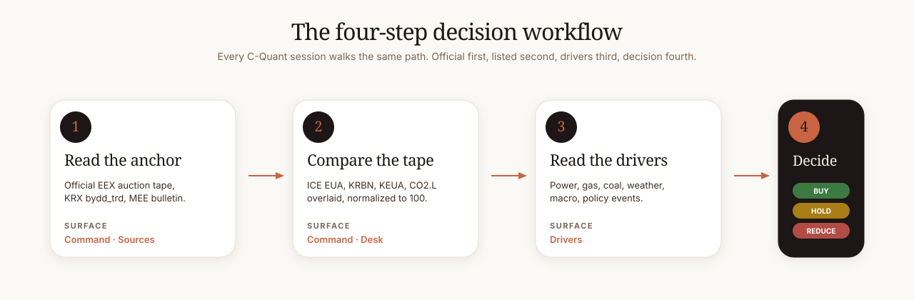
</p>

C-Quant is built around one repeatable session loop. Every screen exists to support one of the four steps.

C-Quant는 하나의 반복 가능한 워크플로우를 중심으로 설계됐습니다. 모든 화면은 네 단계 중 하나를 지원합니다.

| Step | What you do | Where |
|---|---|---|
| **1. Read the anchor** · 공식 앵커 읽기 | Look at the official auction tape (EEX), KRX day data, or MEE bulletin first. | Command / Sources |
| **2. Compare the tape** · 비교 테이프 보기 | Overlay listed proxies (ICE EUA Dec, KRBN, KEUA, CO2.L) on a normalized chart. | Command / Desk |
| **3. Read the drivers** · 드라이버 점검 | Check power, gas, coal, weather, macro, and policy events. | Drivers |
| **4. Decide** · 결정 | Form a posture (buy / hold / reduce) with the support and risks visible. | All surfaces |

**한 줄 요약**: 공식 → 프록시 → 드라이버 → 결정. 매번 같은 순서.

---

## 2. The Command surface / 사령탑 화면

<p align="center">
  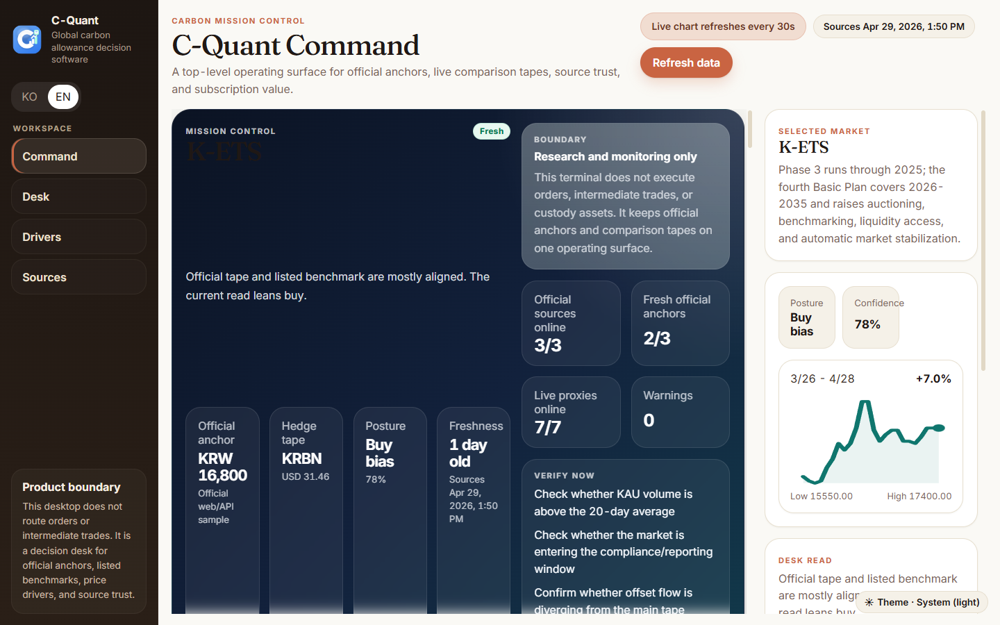
  <br/><sub><i>Real capture from a running build — KRX ETS sample API live, K-ETS focused</i></sub>
</p>

The default landing screen. It answers one question at a glance: **"What should I do today, and why?"**

기본 첫 화면. 한 화면에서 답해야 할 단 하나의 질문에 대답합니다 — **"오늘 무엇을 해야 하고, 왜 그런가?"**

### Reading the screen / 화면 읽는 법

1. **Market strip** (top): three cards — EU ETS, K-ETS, China ETS. The **active market** has the orange accent stripe; the headline price is the **official anchor price**, not a proxy. Tap any card to focus that market.
2. **Anchor vs hedge tape chart** (centre, large): two normalized lines — the **solid orange** is the official anchor, the **dashed green** is the listed proxy. They should generally move together. **Divergence is a story** — see Drivers to find out why.
3. **Decision memo** (right column): the synthesized stance + confidence, plus the explicit support and risk bullets that built it. Read this **after** the chart, not before.
4. **Top drivers** (bottom-left): the five strongest factors and their signed contribution. Long bar = strong, orange = positive, red = negative.
5. **Source freshness** (bottom-mid): chips showing how recent each source is. Green = fresh, gold = watch, red = stale.
6. **Score build** (bottom-right): a confidence donut. The number is the confidence percentile, **not** a return target.

### Daily session recipe / 매일 세션 레시피

```
1. Open C-Quant
2. Glance at the market strip — anything red?
3. Read the chart — anchor and proxy still in step?
4. Read the decision memo — what changed since yesterday?
5. Pin the current view to your watchlist (⌘K → "Pin current view")
```

**한 줄 요약**: 시장 스트립 → 차트 → 의사결정 메모 → 드라이버 → 핀.

---

## 2.5 Desk · Drivers · Sources / 나머지 세 화면

### Desk — single-market deep dive / 한 시장에 집중

<p align="center">
  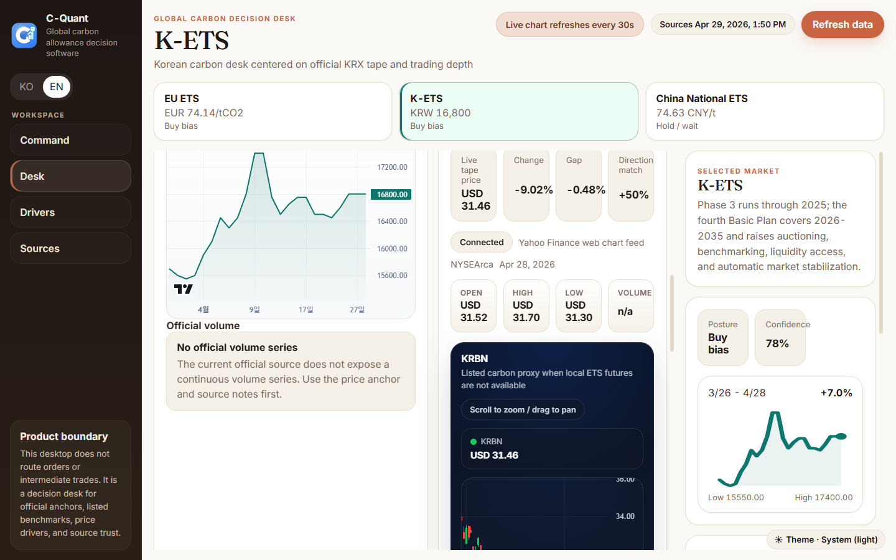
  <br/><sub><i>K-ETS focused: cross-market table, hedge tape (KRBN), CN comparison row, K-ETS chart</i></sub>
</p>

The Desk surface centres on **one** market and shows the full cross-market context next to it: official anchor, hedge tape, range/correlation table, and the focused chart on the right.

Desk 화면은 **하나의** 시장에 집중하면서 다른 시장과의 비교 컨텍스트를 옆에 보여줍니다 — 공식 앵커, 헤지 테이프, 범위/상관성 테이블, 우측에 포커스 차트.

Use Desk when you need to **drill into K-ETS / EU ETS / China ETS individually** — for example, before exporting a market-specific brief.

특정 시장 (K-ETS / EU ETS / 중국 ETS)을 깊이 파야 할 때 사용하세요 — 예: 시장별 브리프를 PDF로 내보내기 전.

### Drivers — what's pushing each market this week / 무엇이 시장을 움직이는가

<p align="center">
  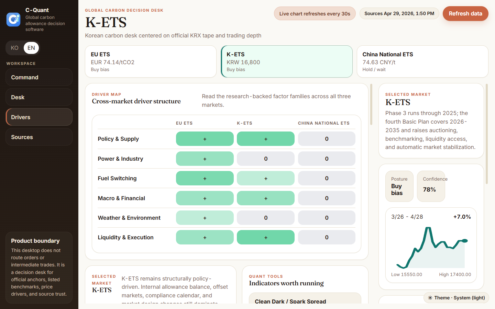
  <br/><sub><i>Six driver families × three markets · score symbols for each cell</i></sub>
</p>

The Drivers heatmap covers the **same six families** across all three markets:

| Family | What it tracks |
|---|---|
| **Policy & Supply** | Cap, allocation, MSR/TNAC, auction calendar |
| **Power & Industry** | Demand, generation mix, industrial activity |
| **Fuel switching** | Gas, coal, oil, clean spark spread |
| **Macro & Financial** | FX, rates, credit, equities |
| **Weather & Environment** | Temperature, wind, hydro |
| **Liquidity & Execution** | Microstructure, auction, open interest |

Drivers 히트맵은 **6개 패밀리 × 3개 시장**을 동시에 봅니다. 각 셀의 기호가 그 시장에 대한 해당 드라이버의 영향 부호와 강도를 나타냅니다.

Read horizontally to compare a market's drivers; vertically to see which family is hot across regions.

가로로 읽으면 한 시장의 드라이버 구조, 세로로 읽으면 어느 패밀리가 글로벌하게 뜨거운지.

### Sources — where every datum came from / 모든 데이터의 출처

<p align="center">
  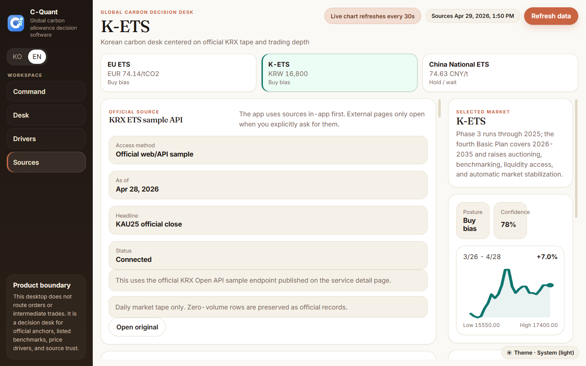
  <br/><sub><i>Source card example: KRX ETS sample API · access method, last updated, status</i></sub>
</p>

Every datum that touches C-Quant has a source card here. Each card shows:

- **Access method** — official web flow / official file / public API / public chart feed
- **Last updated** — the freshness timestamp
- **Status** — connected / waiting / unavailable
- **Open original** — opens the upstream URL in your default browser via `shell.openExternal`

C-Quant에 들어오는 모든 데이터에는 여기 소스 카드가 있습니다. 각 카드는 접근 방식, 마지막 업데이트 시각, 상태, 원본 페이지 열기 버튼을 가집니다.

Use this surface to verify provenance before quoting a number anywhere.

어디서든 숫자를 인용하기 전에 이 화면에서 출처를 확인하세요.

**한 줄 요약**: Desk = 한 시장 깊이, Drivers = 무엇이 미는가, Sources = 어디서 왔는가.

---

## 3. The command palette (⌘K) / 명령 팔레트

<p align="center">
  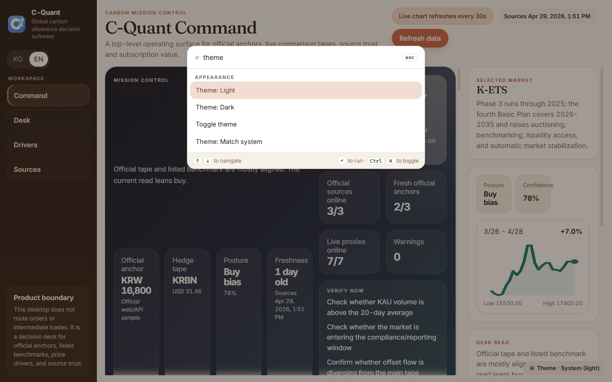
  <br/><sub><i>"theme" typed into the palette — every appearance command rises to the top</i></sub>
</p>

Press **⌘K** (macOS) or **Ctrl+K** (Windows / Linux) **anywhere** to open the palette. Fuzzy search across ~25 commands grouped by intent.

어디서든 **⌘K** (macOS) 또는 **Ctrl+K** (Windows / Linux) 를 눌러 팔레트를 엽니다. 약 25개의 명령이 의도별로 묶여 있고 fuzzy 검색이 가능합니다.

### Most-used commands / 자주 쓰는 명령

| Group | Commands |
|---|---|
| **Appearance** | Theme: Light / Dark / Match system · Toggle theme · Motion: reduce animations |
| **Language** | Switch to English / 한국어로 전환 · Language: 한국어 / English |
| **Workspace** | Open watchlist · Pin current view to watchlist · Open backtest archive |
| **Export** | Export current view as PDF · Export app diagnostics as CSV / Markdown |
| **Updates** | Check for updates · Download update · Install update and restart |
| **Privacy** | Enable / Disable analytics |
| **Diagnostics** | Open app data folder · Open log folder · Open backtests folder |
| **Help** | About C-Quant |

### Keyboard navigation / 키보드 네비게이션

| Key | Action |
|---|---|
| `↑` / `↓` | Move selection · 선택 이동 |
| `Enter` | Run highlighted command · 실행 |
| `Esc` | Close palette · 닫기 |

**한 줄 요약**: ⌘K가 모든 컨트롤의 진입점.

---

## 4. Light & dark mode / 라이트 & 다크 모드

<table>
  <tr>
    <td width="50%"><br/><sub><b>Light · English</b></sub></td>
    <td width="50%">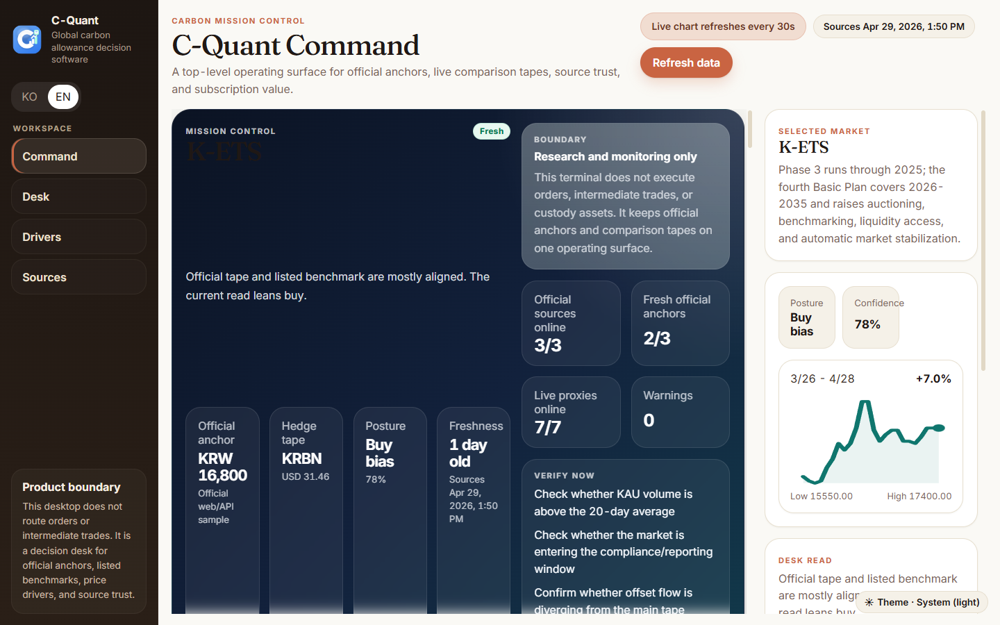<br/><sub><b>Dark · English</b></sub></td>
  </tr>
  <tr>
    <td colspan="2">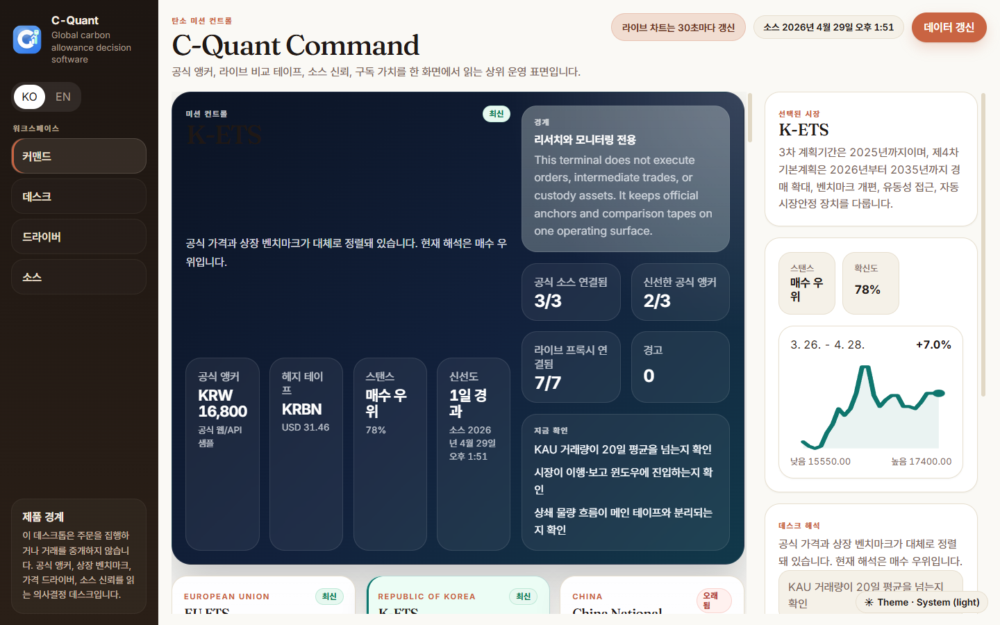<br/><sub align="center"><b>Light · 한국어</b> — 동일 화면, 모든 라벨이 한국어로 자동 전환됩니다 (⌘K → "한국어로 전환")</sub></td>
  </tr>
</table>

The bottom-right floating button **cycles** through `light → system → dark`. Or use ⌘K → "Theme: Dark".

우하단 플로팅 버튼이 `라이트 → 시스템 → 다크` 순으로 토글됩니다. 또는 ⌘K → "Theme: Dark".

The theme is persisted across launches in `<userData>/settings.json`. If you set "Match system", C-Quant follows the OS-level `prefers-color-scheme`.

테마는 다음 실행에도 유지됩니다 (`<userData>/settings.json`). "Match system"을 선택하면 OS의 `prefers-color-scheme`을 따라갑니다.

**한 줄 요약**: 우하단 ☀/☾ 버튼 한 번 클릭하면 다음 모드.

---

## 5. Watchlist & backtest drawers / 워치리스트 + 백테스트 드로어

<p align="center">
  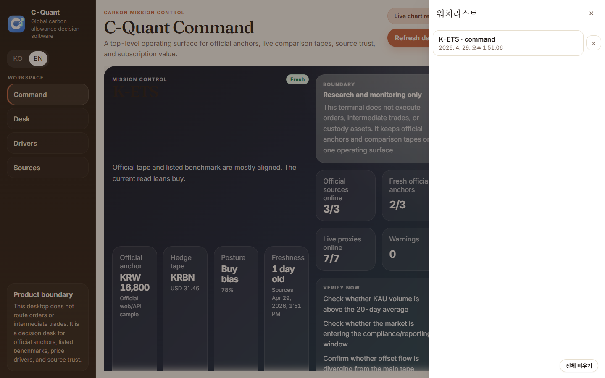
  <br/><sub><i>Drawer slid in from the right · one K-ETS · command view pinned</i></sub>
</p>

### Watchlist / 워치리스트

A **pinned-view** archive. Each entry remembers the surface and market combination so you can jump back without re-navigating.

핀한 뷰 보관함. 각 항목은 surface + market 조합을 기억하므로 바로 복원할 수 있습니다.

| Action | How |
|---|---|
| Pin the current view | ⌘K → "Pin current view to watchlist" |
| Open the drawer | ⌘K → "Open watchlist" |
| Restore a pinned view | Click any row · 행 클릭 |
| Remove a single entry | The `×` button on the right · 우측 × 버튼 |
| Clear all | Footer "Clear all" button |

Stored at `<userData>/watchlist.json`. Capped at 64 entries (oldest evicted first).

`<userData>/watchlist.json`에 저장. 최대 64개 (가장 오래된 것부터 자동 제거).

### Backtest archive / 백테스트 보관함

⌘K → "Open backtest archive". Lists everything saved at `<userData>/backtests/`. Newest first. Each row has Load + Delete actions.

⌘K → "Open backtest archive". `<userData>/backtests/` 의 저장 파일 목록 (최신순). 각 행에 Load + Delete 버튼.

**한 줄 요약**: 핀 → 드로어에서 복원. 백테스트도 같은 패턴.

---

## 6. Exports / 내보내기

C-Quant can export a snapshot in three formats. All open a native save dialog so you control where the file lands.

C-Quant는 세 형식으로 스냅샷을 내보낼 수 있습니다. 모두 네이티브 저장 대화상자가 열립니다.

| Format | Cmd+K command | Use when |
|---|---|---|
| **PDF** | "Export current view as PDF…" | You want to share what you see · 본 화면을 그대로 공유 |
| **CSV** | "Export app diagnostics as CSV…" | You want to put data in Excel · 엑셀로 분석할 때 |
| **Markdown** | "Export app diagnostics as Markdown…" | You want a copy-paste briefing · 메모에 붙여넣기 좋은 형식 |

The PDF uses Electron's `printToPDF`, so it captures exactly what's on screen including the active theme.

PDF는 Electron의 `printToPDF`를 사용하므로 현재 화면을 그대로 (테마 포함) 캡처합니다.

**한 줄 요약**: ⌘K → Export. PDF / CSV / Markdown 중 선택.

---

## 7. Drag-and-drop CSV / CSV 드래그앤드롭

Drop **any CSV / TSV / TXT file** anywhere on the C-Quant window. C-Quant validates the extension and size (≤ 8 MB), reads the file, and dispatches a `cquant:csv-dropped` event the active surface can listen for.

C-Quant 창 어디에나 **CSV / TSV / TXT 파일**을 드래그하면 인식합니다. 확장자와 크기 (≤ 8 MB)를 검증하고 파일을 읽어 활성 surface가 구독할 수 있는 `cquant:csv-dropped` 이벤트를 발생시킵니다.

A toast confirms success or rejection.

토스트로 성공/거부를 알립니다.

**한 줄 요약**: 그냥 끌어다 놓으면 됩니다. 8 MB 이하.

---

## 8. Updates / 업데이트

<p align="center">
  <em>The update banner appears when a new version is available.</em>
</p>

When the auto-updater detects an available release on GitHub, a banner slides down from the top with **Download / Restart & install / Later** buttons. You can also trigger a check manually:

자동 업데이터가 GitHub에서 새 릴리스를 감지하면 화면 상단에 배너가 내려옵니다 (**Download / Restart & install / Later** 버튼). 수동 확인:

```
⌘K → "Check for updates"
⌘K → "Download update"
⌘K → "Install update and restart"
```

To **disable** the auto-updater entirely (e.g. for portable users on metered networks):

자동 업데이터를 완전히 끄려면 (예: 데이터 종량제 사용자):

```bash
CQUANT_DISABLE_UPDATER=1
```

**한 줄 요약**: 업데이트가 있으면 배너가 알려주고, 클릭 한 번으로 설치.

---

## 9. Privacy / 프라이버시

C-Quant is **off by default** for telemetry. Two flags must align before a single byte leaves the machine:

C-Quant는 기본적으로 **수집 꺼짐**입니다. 두 조건이 모두 충족돼야만 단 1바이트도 외부로 나가지 않습니다:

1. The user opts in via ⌘K → "Enable analytics" (`analyticsEnabled` setting)
2. The operator has set `CQUANT_ANALYTICS_ENDPOINT` environment variable

If either is missing, every event call is a no-op. There's no fallback DSN baked into the binary.

둘 중 하나라도 빠지면 모든 이벤트는 no-op. 바이너리에 fallback DSN이 박혀있지 않습니다.

Crash reporting via Sentry is similarly opt-in (`CQUANT_SENTRY_DSN`). See [SECURITY.md](../SECURITY.md) for the full threat model.

Sentry 크래시 리포트도 같은 패턴 (`CQUANT_SENTRY_DSN`). 전체 위협 모델은 [SECURITY.md](../SECURITY.md).

**한 줄 요약**: 기본 OFF. 명시적으로 켜야만 분석 데이터가 나갑니다.

---

## 10. Architecture at a glance / 한눈에 보는 아키텍처

<p align="center">
  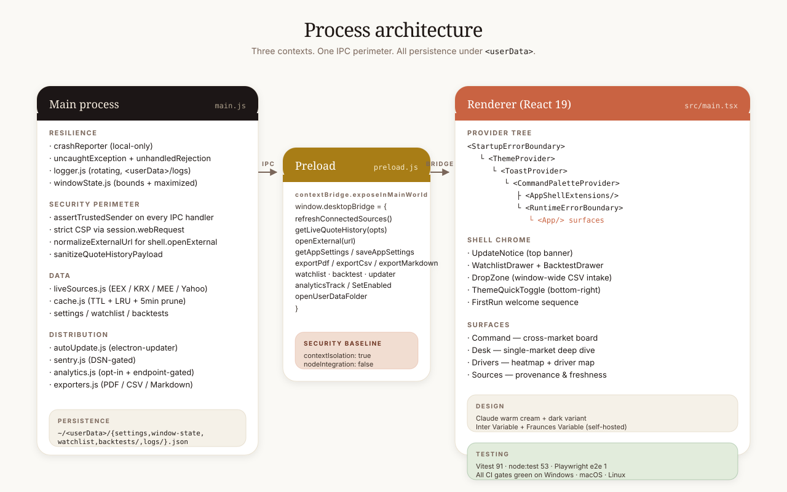
</p>

Three execution contexts, one IPC perimeter, all persistence under `<userData>`. See [docs/ARCHITECTURE.md](ARCHITECTURE.md) for the full module map.

세 실행 컨텍스트, 단일 IPC 경계, 모든 영속화는 `<userData>` 아래. 전체 모듈 맵은 [docs/ARCHITECTURE.md](ARCHITECTURE.md).

---

## 11. First-run checklist / 첫 실행 체크리스트

When you launch C-Quant for the first time, three timed welcome toasts will appear (welcome → theme/language → privacy). After they pass:

처음 실행하면 세 개의 환영 토스트가 순차로 나타납니다 (환영 → 테마/언어 → 프라이버시). 그 다음:

- [ ] Press **⌘K** to confirm the palette opens
- [ ] Try the floating **theme toggle** (bottom-right)
- [ ] If you read mostly Korean: ⌘K → **"한국어로 전환"**
- [ ] Open the **Sources** screen — confirm at least one anchor is fresh
- [ ] Pin a view: ⌘K → **"Pin current view to watchlist"**
- [ ] (Optional) Configure your KRX key: `CQUANT_KRX_AUTH_KEY`
- [ ] (Optional) Decide on analytics: ⌘K → "Enable analytics" if you want it on

**한 줄 요약**: ⌘K 한 번 눌러보면 끝납니다.

---

## 12. Where things live on disk / 파일 위치

| What | Where |
|---|---|
| Settings (theme, locale, motion) | `<userData>/settings.json` |
| Window position + maximized | `<userData>/window-state.json` |
| Watchlist (pinned views) | `<userData>/watchlist.json` |
| Backtest archive | `<userData>/backtests/<id>.json` |
| Rotating logs | `<userData>/logs/cquant.log[.1.2.3]` |
| Startup diagnostics | `<userData>/logs/startup-diagnostics.log` |

`<userData>` resolves to:

`<userData>` 위치:

| OS | Path |
|---|---|
| Windows | `%APPDATA%\C-Quant\` |
| macOS | `~/Library/Application Support/C-Quant/` |
| Linux | `~/.config/C-Quant/` |

You can open it directly: ⌘K → **"Open app data folder"**.

직접 열기: ⌘K → **"Open app data folder"**.

**한 줄 요약**: 모든 영속 데이터는 OS의 userData 폴더 아래.

---

## 13. Troubleshooting / 트러블슈팅

| Symptom · 증상 | Try · 시도 |
|---|---|
| Live tape shows error | Restart the app · Yahoo Finance v8 endpoint may be temporarily blocked. |
| 라이브 테이프에 에러 표시 | 앱 재시작 · Yahoo Finance 엔드포인트가 일시적으로 막힐 수 있습니다. |
| Window opens off-screen | The window-state file may have stale bounds. ⌘K → "Open app data folder" → delete `window-state.json` → relaunch. |
| 창이 화면 밖에서 열림 | window-state 파일이 오래됐을 수 있습니다. `<userData>/window-state.json` 삭제 후 재실행. |
| Renderer fails on startup | The startup boundary will tell you. Check `<userData>/logs/startup-diagnostics.log` and share that with the maintainer. |
| 렌더러 시작 실패 | 시작 경계에서 메시지를 보여줍니다. `startup-diagnostics.log` 를 메인테이너와 공유. |
| Update banner won't go away | It returns when state is "available" or "downloaded". Click **Later** to hide for the session. |
| 업데이트 배너가 안 사라짐 | 상태가 "available" / "downloaded" 인 동안 표시됩니다. **Later**로 세션 동안 숨김. |
| ⌘K does nothing | The renderer may not have mounted. Look for the StartupErrorBoundary card with a stack trace. |
| ⌘K가 작동하지 않음 | 렌더러가 마운트되지 않았을 수 있습니다. StartupErrorBoundary 카드를 확인. |

For anything else, file an issue at [github.com/hyunjin-kor/C-Quant/issues](https://github.com/hyunjin-kor/C-Quant/issues) and include the contents of `<userData>/logs/cquant.log` for the relevant time window.

그 외에는 [github.com/hyunjin-kor/C-Quant/issues](https://github.com/hyunjin-kor/C-Quant/issues) 에 이슈를 등록하고, 해당 시간대의 `cquant.log` 를 첨부해 주세요.

---

## 14. The truth boundary / 진실 경계

C-Quant is **research and monitoring** software. It does **not**:

C-Quant는 **리서치와 모니터링** 도구입니다. 다음 작업은 **하지 않습니다**:

- Execute trades or place orders · 주문 체결
- Custody assets · 자산 보관
- Settle or intermediate carbon transactions · 탄소 거래 정산 / 중개
- Provide one-to-one trading instructions · 일대일 거래 지시
- Guarantee that vendor proxies (KRBN, KEUA, CO2.L, ICE EUA) replace official settlement prices · 프록시가 공식 정산가를 대체한다고 보장

If you see something in C-Quant that suggests otherwise, file a bug. The product boundary is part of the spec.

만약 위 경계를 넘는 동작이 보이면 버그로 신고해 주세요. 제품 경계는 스펙의 일부입니다.

**한 줄 요약**: 의사결정 보조 도구이지 자동 거래 도구가 아닙니다.

---

<p align="center">
  <sub>
    Surface screenshots are real captures of a running build (regenerate with <code>npm run capture</code>).<br/>
    Decision-flow and architecture diagrams remain hand-drawn SVGs.<br/>
    화면 캡처는 실제 빌드를 실행한 결과입니다 (<code>npm run capture</code>로 재생성).<br/>
    의사결정 흐름과 아키텍처 다이어그램은 손으로 그린 SVG입니다.
  </sub>
</p>
